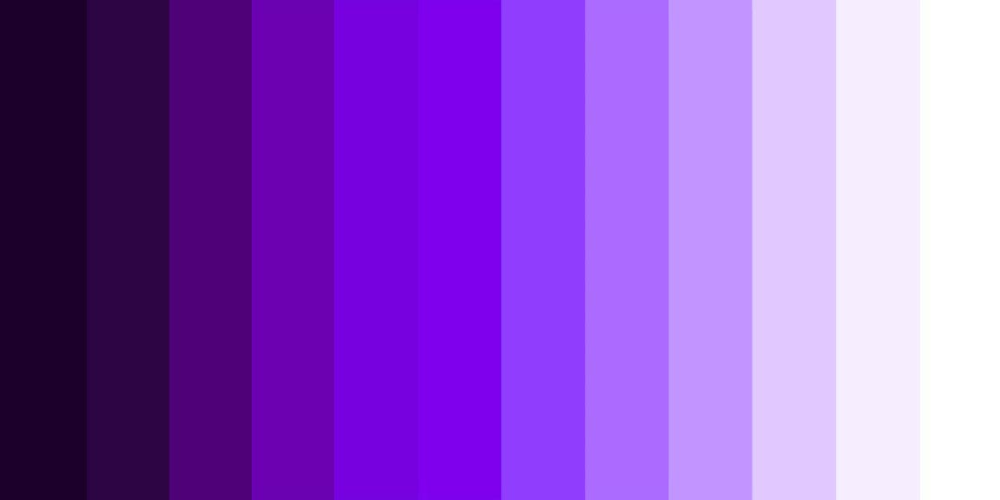

import HomepageTemplate from 'gatsby-theme-carbon/src/templates/Homepage';
export default HomepageTemplate;

## Quickstart Guides

<PageDescription>

Different paths with the same goal. 

</PageDescription>

<FeatureCard
    color="dark"
    href="/getting-started"
    title="Getting started (for Designers)"
    actionIcon="arrowRight"
    className="homepage-feature">

<ArtDirection>

</ArtDirection>
</FeatureCard>

<FeatureCard
    color="dark"
    href="/developers/getting-started-dev"
    title="Getting started (for Developers)"
    actionIcon="arrowRight"
    className="homepage-feature">

<ArtDirection>

</ArtDirection>
</FeatureCard>